# Secure Azure Network Architecture

## Project Overview

This project builds a secure Azure hub-and-spoke network architecture using Terraform. The goal was to create a centralized network security design where traffic between two spoke virtual networks is forced through Azure Firewall instead of routing directly between workloads.

The environment included a hub VNet, two spoke VNets, Azure Firewall Basic, VNet peering, user-defined routes, Linux virtual machines, Network Security Groups, Log Analytics, Azure Firewall diagnostic logs, KQL queries, and traffic validation.

This project demonstrates how cloud teams can control east-west network traffic, inspect connections between workloads, and collect firewall logs for security investigation.

---

## Business Problem

In many cloud environments, workloads are separated across different networks or environments such as development, testing, and production. Without centralized inspection, traffic between those environments may flow directly across peered networks without passing through a security control.

This creates several risks:

- Limited visibility into traffic moving between internal networks
- No centralized enforcement point for network security rules
- Difficulty proving whether traffic was allowed or denied
- Weak auditability for security investigations
- Higher chance of misconfigured routing between environments

This project solves that by deploying a hub-and-spoke design where Azure Firewall acts as the central inspection point for spoke-to-spoke traffic.

---

## Azure Services Used

- Azure Virtual Network
- Hub-and-Spoke Network Architecture
- Azure Firewall Basic
- Azure Firewall Management Subnet
- Azure Public IP
- VNet Peering
- Route Tables
- User Defined Routes
- Network Security Groups
- Azure Linux Virtual Machines
- Network Interfaces
- Log Analytics Workspace
- Azure Monitor Diagnostic Settings
- Azure Firewall Network Rule Logs
- Kusto Query Language
- Storage Account
- Network Watcher
- Terraform
- Azure CLI
- GitHub

---

## Architecture

The project deploys the following Azure resources:

```text
rg-secure-network-kylon
├── Hub VNet: vnet-hub-kylon
│   ├── AzureFirewallSubnet: 10.0.1.0/24
│   ├── AzureFirewallManagementSubnet: 10.0.3.0/26
│   └── Hub Management Subnet: 10.0.2.0/24
│
├── Azure Firewall Basic: fw-secure-network-kylon
│   ├── Private IP: 10.0.1.4
│   ├── Public IP
│   ├── Management Public IP
│   └── Network Rule Collection: allow-spoke-to-spoke
│
├── Spoke 1 VNet: vnet-spoke1-kylon
│   ├── Address Space: 10.1.0.0/16
│   ├── Subnet: 10.1.1.0/24
│   ├── VM: vm-spoke1-kylon
│   └── Private IP: 10.1.1.4
│
├── Spoke 2 VNet: vnet-spoke2-kylon
│   ├── Address Space: 10.2.0.0/16
│   ├── Subnet: 10.2.1.0/24
│   ├── VM: vm-spoke2-kylon
│   └── Private IP: 10.2.1.4
│
├── Route Table: rt-spoke1-kylon
│   └── Route to 10.2.0.0/16 through Azure Firewall
│
├── Route Table: rt-spoke2-kylon
│   └── Route to 10.1.0.0/16 through Azure Firewall
│
├── Network Security Group: nsg-spokes-kylon
│   ├── Allow internal ICMP
│   └── Allow internal TCP
│
├── Log Analytics Workspace: law-secure-network-kylon
│   └── Azure Firewall diagnostic logs
│
└── Storage Account
    └── Flow log / monitoring storage
```

---

## Network Traffic Flow

The intended traffic path was:

```text
Spoke 1 VM → Spoke 1 Route Table → Azure Firewall → Spoke 2 VM
```

Traffic from Spoke 1 to Spoke 2 was forced through Azure Firewall using a user-defined route.

Spoke 1 route table:

```text
Destination: 10.2.0.0/16
Next hop type: Virtual appliance
Next hop IP: 10.0.1.4
```

Spoke 2 route table:

```text
Destination: 10.1.0.0/16
Next hop type: Virtual appliance
Next hop IP: 10.0.1.4
```

This prevented the spoke networks from relying only on default VNet peering routes and created a centralized firewall inspection point.

---

## Security Controls Implemented

### Azure Firewall

Azure Firewall Basic was deployed into the hub VNet to inspect traffic between the spoke networks.

The firewall rule collection allowed controlled ICMP and TCP traffic between the two spoke address spaces:

```text
Source: 10.1.0.0/16, 10.2.0.0/16
Destination: 10.1.0.0/16, 10.2.0.0/16
Protocols: ICMP, TCP
Action: Allow
```

### Network Security Group

A Network Security Group was associated with the spoke subnets to allow internal test traffic while still keeping the VMs private.

The VMs were deployed without public IP addresses.

### User Defined Routes

Custom route tables were used to override default routing and send spoke-to-spoke traffic to the Azure Firewall private IP.

### Diagnostic Logging

Azure Firewall diagnostic logs were sent to Log Analytics so allowed and denied traffic could be queried using KQL.

---

## Terraform Deployment

### Initialize Terraform

```bash
terraform init
```

### Format Terraform Files

```bash
terraform fmt
```

### Validate Configuration

```bash
terraform validate
```

### Create Terraform Plan

```bash
terraform plan -out=tfplan
```

### Apply Terraform Plan

```bash
terraform apply "tfplan"
```

---

## Deployment Evidence

### Terraform Validation

Terraform validation completed successfully before deployment.

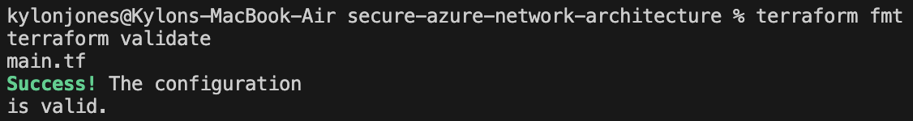

### Terraform Plan

Terraform generated a deployment plan before resources were created.

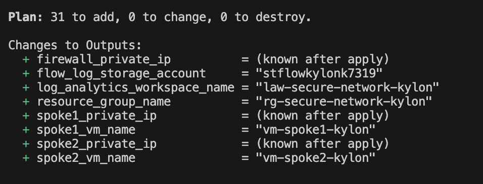

### Terraform Apply

Terraform successfully deployed the secure Azure network architecture.

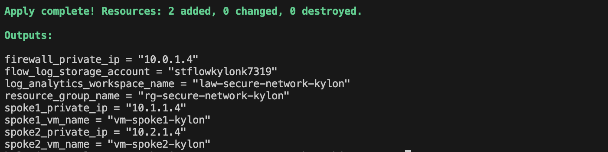

---

## Azure Resource Group

The deployed resource group contained the hub VNet, spoke VNets, Azure Firewall, Linux VMs, route tables, NSG, Log Analytics workspace, storage account, network interfaces, and public IP resources.

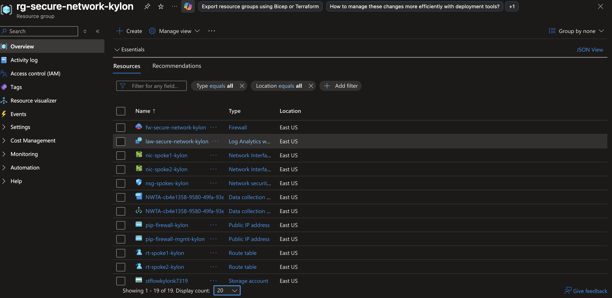

---

## Hub VNet

The hub VNet hosted the Azure Firewall subnet, firewall management subnet, and hub management subnet.


---

## Spoke VNets

Each spoke VNet contained one Linux VM and was peered with the hub VNet.

### Spoke 1

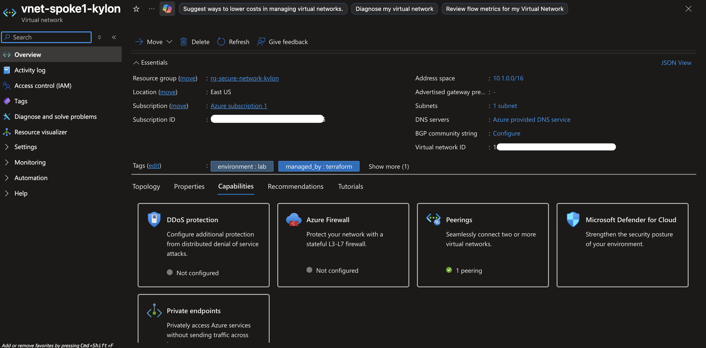

### Spoke 2

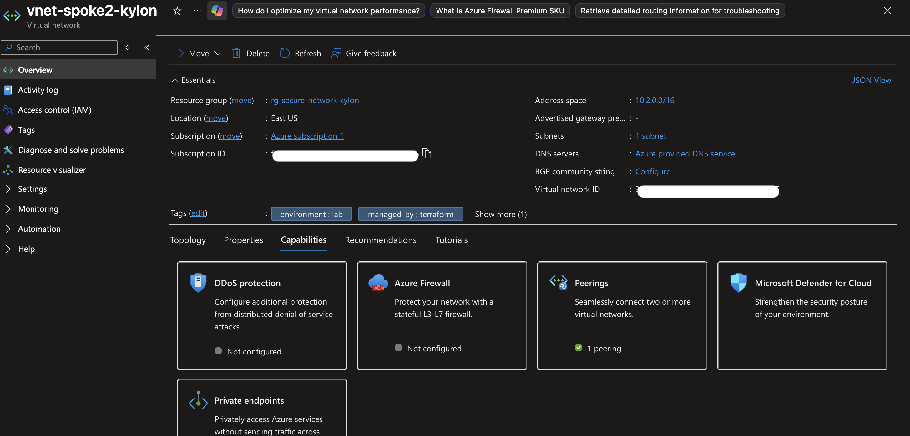

---

## Azure Firewall

Azure Firewall Basic was deployed in the hub VNet as the central inspection point for spoke-to-spoke traffic.

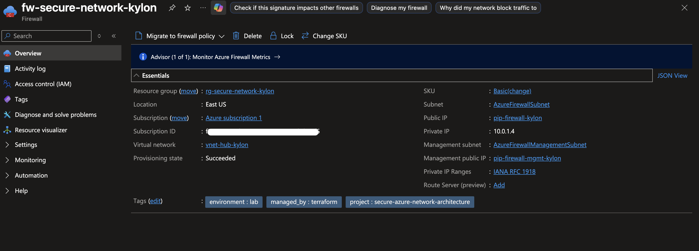

---

## Route Table Validation

A route table was configured to force traffic between spokes through the firewall private IP.

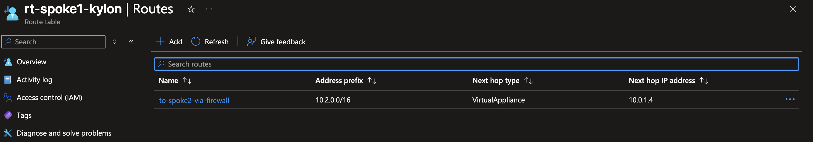

---

## Firewall Rule Validation

The firewall rule collection allowed ICMP and TCP traffic between the spoke networks.

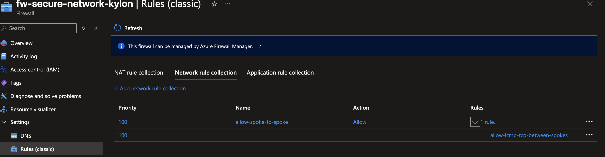

---

## NSG Rule Validation

The Network Security Group allowed internal ICMP and TCP traffic for the lab validation.

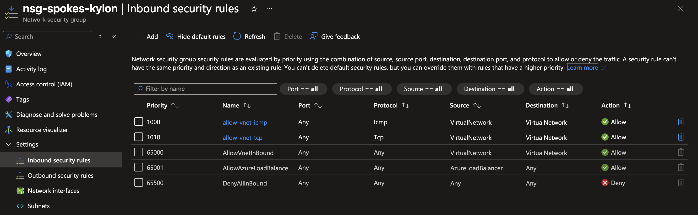

---

## Traffic Testing

Traffic was tested from the Spoke 1 VM to the Spoke 2 VM using Azure VM Run Command.

Command used:

```bash
ping -c 4 10.2.1.4
```

The successful ping confirmed that private traffic between the spoke VMs was allowed.

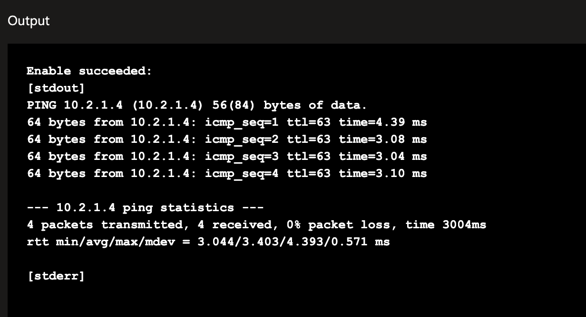

---

## Firewall Deny Test

To prove Azure Firewall was enforcing traffic control, the firewall rule was temporarily changed from `Allow` to `Deny`.

The ping test was then repeated from Spoke 1 to Spoke 2.

Result:

```text
4 packets transmitted, 0 received, 100% packet loss
```

This confirmed that the firewall was controlling traffic between the spoke networks.

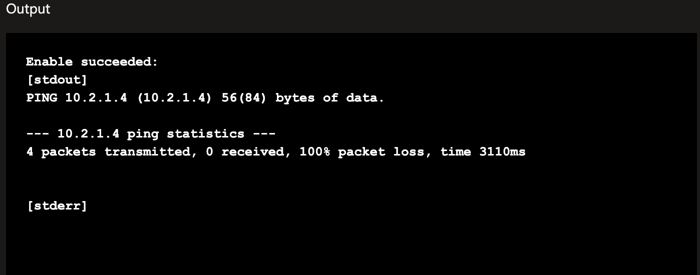

After testing, the firewall rule was changed back to `Allow`.

---

## KQL Log Analysis

Azure Firewall logs were sent to Log Analytics and queried using KQL.

Query used:

```kql
AZFWNetworkRule
| where TimeGenerated > ago(2h)
| project TimeGenerated, Action, SourceIp, DestinationIp, DestinationPort, Protocol, RuleCollection, Rule
| order by TimeGenerated desc
```

The KQL results showed both allowed and denied ICMP traffic between the spoke VMs.

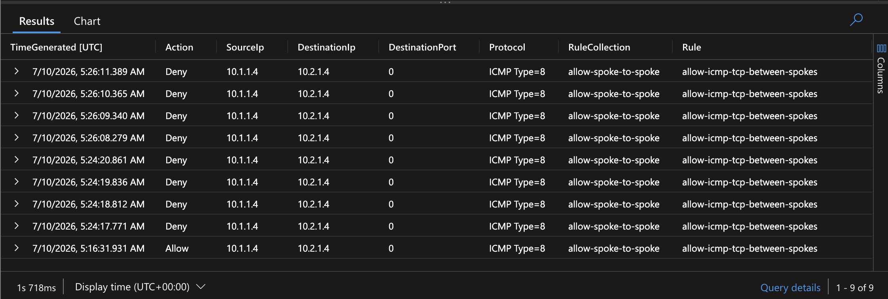

This confirmed that Azure Firewall was not only routing traffic but also logging security decisions.

---

## Troubleshooting

### Issue 1: Terraform Function Error

Terraform failed because `regexreplace` was not a valid function in the configuration.

Fix:

```hcl
clean_name = lower(replace(var.yourname, "/[^a-z0-9]/", ""))
```

---

### Issue 2: Azure Firewall Basic Management IP Requirement

Azure Firewall Basic required a management subnet and management IP configuration.

Fix:

- Added `AzureFirewallManagementSubnet`
- Added a firewall management public IP
- Added `management_ip_configuration` to the Azure Firewall resource

Example:

```hcl
management_ip_configuration {
  name                 = "fw-mgmt-ipconfig"
  subnet_id            = azurerm_subnet.firewall_management.id
  public_ip_address_id = azurerm_public_ip.firewall_management.id
}
```

---

### Issue 3: VM SKU Availability in East US

The original VM size was unavailable in East US.

Attempted VM sizes:

```text
Standard_B1s
Standard_B1ms
Standard_B2s
```

Final working VM size:

```text
Standard_D2s_v3
```

This allowed the deployment to complete successfully.

---

### Issue 4: Monitoring Resource Cleanup

During cleanup, some Microsoft Insights data collection resources remained after Terraform destroy.

Fix:

The leftover resources were deleted with Azure CLI, then Terraform destroy was rerun.

```bash
az resource list -g rg-secure-network-kylon -o table
```

After removing the leftover monitoring resources, the final cleanup completed successfully.

---

## Cleanup

All Azure resources were destroyed after validation to avoid ongoing cost.

```bash
terraform destroy
```

Final verification confirmed the resource group no longer existed.


---

## Cost Control

This project used Azure Firewall and virtual machines, which can create ongoing cost if left running.

Cost-control actions taken:

- Used a short lab window
- Avoided unnecessary premium services
- Did not deploy Bastion, Private Endpoints, Application Gateway, or Load Balancer
- Destroyed resources immediately after validation
- Verified the resource group no longer existed

---

## Skills Demonstrated

- Azure hub-and-spoke network design
- Secure network segmentation
- Azure Firewall deployment
- Firewall rule configuration
- User Defined Routes
- VNet peering
- Network Security Groups
- Private IP VM communication
- Terraform infrastructure as code
- Azure Monitor diagnostic settings
- Log Analytics
- KQL traffic analysis
- Azure troubleshooting
- Cloud cost control
- GitHub documentation

---

## Project Outcome

This project successfully deployed a Terraform-managed secure Azure network architecture. The final design forced traffic between two spoke VNets through Azure Firewall, validated firewall allow and deny behavior, captured logs in Log Analytics, and used KQL to confirm traffic inspection.

The project also included real troubleshooting around Terraform syntax, Azure Firewall Basic requirements, VM SKU capacity, and cleanup of monitoring resources.

Finally, this project strengthened practical skills in Azure networking, cloud security architecture, infrastructure as code, monitoring, and operational troubleshooting.
